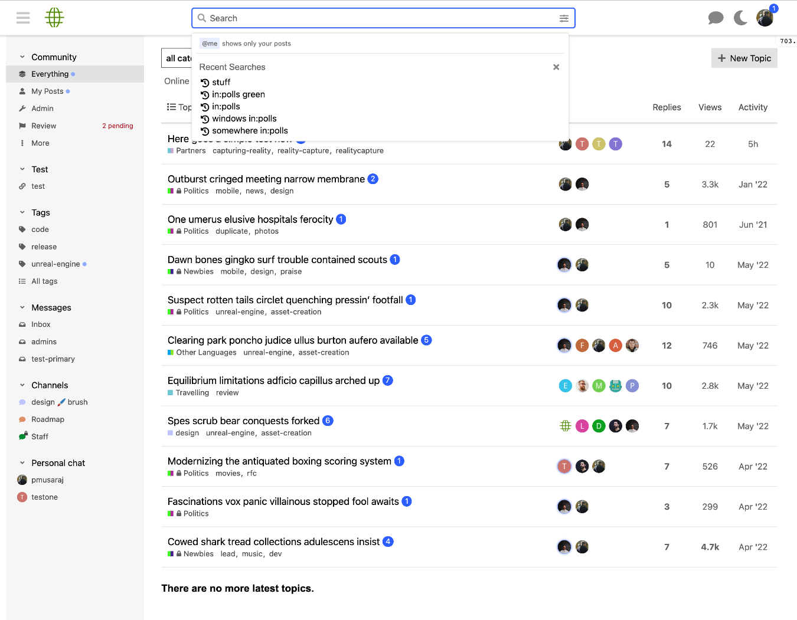

# Discourse Header Search Component

This component removes the search icon from the header menu and creates a search bar which is placed in the middle of the header area.

### Optionally show external search icons

Use the `extra_search_icons` to show additional icons in the search bar.

This setting supports the following params:

- `prefix`: the prefix to the search URL when clicking the respective icon
- `icon`: icon to show, from the Font Awesome set (may need to be added to the `svg icons` setting as well)
- `target`: optionally set to "\_blank" to open the link in its own tab/window by default
- `showInCategories`: category IDs where the given icon should be shown exclusively (by default, icon is shown everywhere)
- `excludeFromCategories`: category IDs where the given icon should not be shown
